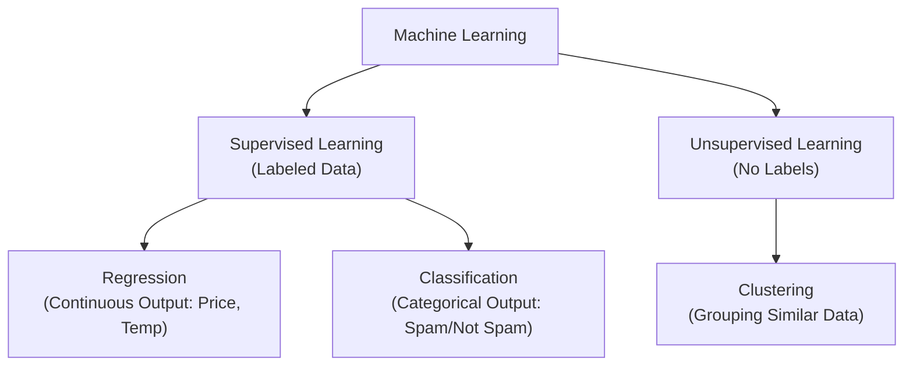

# Chapter 3: Applications of AI and ML in Real-World Use Cases

> **THE AWS CERTIFIED AI PRACTITIONER EXAM OBJECTIVES COVERED IN THIS CHAPTER INCLUDE:**
> *   **Domain 1**: Fundamentals of AI and ML
>     *   **Task Statement 1.2**: Identify practical use cases for AI.
> *   **Domain 2**: Fundamentals of Generative AI
>     *   **Task Statement 2.1**: Explain the basic concepts of generative AI.

---

## Introduction: Why AI and ML Matter for Business
*   **The Promise**: AI/ML enables organizations to derive actionable insights from vast amounts of data, reducing uncertainty in decision-making.
*   **The Competitive Edge**: Companies using AI-driven analytics gain the ability to predict trends, optimize processes, and adapt swiftly to market changes—driving ROI and staying ahead of the curve.
*   **This Chapter**: Covers when AI works, when it doesn't, and how to choose the right ML technique for the job.

---

## 1. Key Trends in AI and ML Applications
Organizations leverage AI/ML across five major themes. Understand these to identify where AI can add the most value.

### Trend 1: Automation of Repetitive Tasks
*   **Goal**: Free up human resources from labor-intensive work.
*   **Analogy**: Think of AI as a tireless factory worker who never gets bored or makes typos.

| Domain | Use Case | How AI/ML Helps |
| :--- | :--- | :--- |
| **Finance** | Automated data entry | AI extracts info from documents (invoices, contracts), reducing manual errors and speeding up processing. |
| **Customer Service** | Support chatbots | Handle routine inquiries ("Where's my order?") instantly, freeing agents for complex issues. |
| **Manufacturing** | Inventory tracking | Automate supply chain tasks (reordering, warehouse management) to increase productivity. |
| **Cross-domain** | Process automation | Ensure consistency and improve overall business efficiency. |

### Trend 2: Predictive Analytics and Forecasting
*   **Goal**: Anticipate future outcomes based on historical data.
*   **Analogy**: A weather forecast for your business—using past patterns to predict the future.

| Domain | Use Case | How AI/ML Helps |
| :--- | :--- | :--- |
| **Finance** | Credit risk, fraud detection | Assess risk likelihood, forecast market trends, detect transaction anomalies. |
| **Retail** | Customer demand prediction | Manage inventory effectively, reduce stockouts, improve supply chain efficiency. |
| **Healthcare** | Patient outcome forecasting | Identify high-risk patients, predict recovery time, improve treatment plans. |
| **Marketing** | Customer behavior analysis | Predict buying patterns, tailor marketing campaigns for higher conversion. |

### Trend 3: Personalization
*   **Goal**: Tailor user experiences to increase engagement and satisfaction.
*   **Analogy**: A personal concierge who knows your preferences and anticipates your needs.

| Domain | Use Case | How AI/ML Helps |
| :--- | :--- | :--- |
| **E-commerce** | Product recommendations | Analyze browsing history and purchase behavior to recommend relevant products, boosting sales and loyalty. |
| **Media/Entertainment** | Content recommendations | Suggest shows, movies, or music based on past interactions (Netflix, Spotify). |
| **Education** | Customized learning | Adapt course content to individual student needs for better learning outcomes. |
| **Marketing** | Personalized campaigns | Segment audiences and deliver targeted messages for higher engagement. |

### Trend 4: Enhanced Decision-Making
*   **Goal**: Provide deep insights and recommendations for confident, data-driven choices.
*   **Analogy**: A highly informed advisor who can process millions of data points in seconds.

| Domain | Use Case | How AI/ML Helps |
| :--- | :--- | :--- |
| **Healthcare** | Diagnosis and treatment planning | Analyze patient records, medical images, and clinical research for accurate and timely decisions. |
| **Finance** | Investment and risk assessment | Real-time market insights and trend identification for better portfolio management. |
| **Logistics** | Supply chain optimization | Analyze shipping routes, weather conditions, and demand forecasts for smarter delivery. |
| **Manufacturing** | Production scheduling | Dynamically adjust schedules based on real-time data to improve resource utilization. |

### Trend 5: Cost Optimization
*   **Goal**: Reduce expenses without compromising quality or efficiency.
*   **Analogy**: Finding the most fuel-efficient route on a road trip, but for your entire business operation.

| Domain | Use Case | How AI/ML Helps |
| :--- | :--- | :--- |
| **Manufacturing** | Energy consumption optimization | Analyze production schedules to identify opportunities to reduce energy waste. |
| **Logistics** | Cost-effective route planning | Determine optimal transportation routes considering fuel, traffic, and deadlines. |
| **Energy** | Energy demand prediction | Predict demand and optimize renewable resource usage for cost savings. |
| **Retail** | Pricing strategy optimization | Analyze consumer behavior, competitor pricing, and inventory to set optimal prices. |
| **Healthcare** | Drug discovery | Accelerate drug discovery, reducing the time and costs of bringing new drugs to market. |

---

## 2. When NOT to Use AI/ML (Unsuitable Use Cases)
AI is powerful, but it's not a magic wand. Recognizing when *not* to use AI is just as important as knowing when to use it.

| Characteristic | Why It's Unsuitable | Example |
| :--- | :--- | :--- |
| **Lack of Quality Data** | Models need large, clean, labeled datasets. Poor/imbalanced data = bad predictions. | Trying to predict with only 50 data points. |
| **Well-Defined Rules** | If simple "If X, then Y" logic works 100% of the time, use a rule-based system. AI is overkill. | Calculating taxes based on fixed brackets. |
| **Need for 100% Accuracy** | ML is probabilistic. If an error causes safety issues or major financial losses, use rigorous rule-based systems. | Air traffic control decisions. |
| **Ambiguous Business Objectives** | AI needs measurable goals. "Make us better" is not a valid objective. | "Use AI to improve things." |
| **Ethical/Regulatory Constraints** | In strict fields (Finance, Insurance), "Black Box" models might be prohibited or face legal barriers. | Credit scoring in highly regulated markets. |

---

## 3. Choosing the Right ML Technique
This is the core of the chapter. Understand the differences between **Regression**, **Classification**, and **Clustering**.

*(Figure 3.1: Choosing the right ML technique)*

---

### A. Regression: Predicting Continuous Numbers
*   **Definition**: Predict a numerical value that can be any number (e.g., price, temperature, recovery time).
*   **Analogy**: Estimating the price of a house based on its features. You're not picking a category; you're calculating a specific dollar amount.
*   **Key Characteristic**: The output is a real number on a continuous scale.

#### Data Labeling for Regression
*   You need a dataset where each input row has a corresponding numerical target.
*   **Example: Predicting House Prices**

| Size (Sq. Ft.) | Number of Rooms | Location Score | Price ($) (Target) |
| :---: | :---: | :---: | :---: |
| 1500 | 3 | 8 | 300,000 |
| 2000 | 4 | 9 | 450,000 |
| 1200 | 2 | 6 | 200,000 |

#### Regression Metrics
*   **MAE (Mean Absolute Error)**: Average of absolute differences between predicted and actual values.
*   **MSE (Mean Squared Error)**: Average of squared differences (penalizes large errors more).
*   **RMSE (Root Mean Squared Error)**: Square root of MSE, back in the original units (e.g., dollars).

#### Regression Use Cases & Algorithms
| Use Case | Suggested Algorithms | How Applied |
| :--- | :--- | :--- |
| **Credit risk assessment** | Linear Regression, Random Forest | Predict risk score based on financial history. |
| **Customer demand prediction** | Time Series Regression | Analyze past sales to predict future inventory needs. |
| **Patient outcome forecasting** | Linear Reg, Gradient Boosting | Predict recovery time using patient data (age, symptoms, tests). |
| **Supply chain optimization** | Decision Tree Reg, XGBoost | Evaluate historical shipment data to optimize routes and costs. |
| **Energy consumption optimization** | Linear Regression | Analyze energy usage patterns to reduce waste. |
| **Cost-effective route planning** | Random Forest Regression | Use distance, traffic, fuel data to find cheapest routes. |
| **Energy demand prediction** | Time Series Regression | Forecast future energy needs from historical trends. |
| **Pricing strategy optimization** | Gradient Boosting | Dynamically adjust prices based on market demand and competition. |

---

### B. Classification: Predicting Categories
*   **Definition**: Assign an input to one of a limited set of discrete categories (e.g., Spam/Not Spam, Disease/No Disease).
*   **Analogy**: Sorting mail into "Junk" and "Important" folders. You're not calculating a number; you're picking a bucket.
*   **Key Characteristic**: The output is a class label, not a number.

#### Data Labeling for Classification
*   You need a dataset where each input row has a corresponding category label.
*   **Example: Spam Detection**

| Email Text Length | Number of Links | Sender Reputation | Spam Classification (Target) |
| :---: | :---: | :---: | :---: |
| 500 | 3 | Low | Spam |
| 1200 | 1 | High | Not Spam |
| 750 | 5 | Medium | Spam |

#### Classification Metrics: The Confusion Matrix
This is a fundamental tool for evaluating classification models.

|  | **Predicted: Positive** | **Predicted: Negative** |
| :--- | :---: | :---: |
| **Actual: Positive** | True Positive (TP) ✔ | False Negative (FN) ✖ (Type II Error) |
| **Actual: Negative** | False Positive (FP) ✖ (Type I Error) | True Negative (TN) ✔ |

*   **True Positive (TP)**: Model correctly predicted positive (e.g., flagged spam as spam).
*   **True Negative (TN)**: Model correctly predicted negative (e.g., let a real email through).
*   **False Positive (FP) - Type I Error**: Model incorrectly predicted positive (e.g., marked a real email as spam). The "Crying Wolf" error.
*   **False Negative (FN) - Type II Error**: Model incorrectly predicted negative (e.g., let a spam email through). The "Missed it" error.

**Common Metrics Derived from the Confusion Matrix:**
*   **Accuracy**: `(TP + TN) / Total`. Overall correctness.
*   **Precision**: `TP / (TP + FP)`. Of all positive *predictions*, how many were correct? (Useful when FP is costly).
*   **Recall (Sensitivity)**: `TP / (TP + FN)`. Of all *actual* positives, how many did we catch? (Useful when FN is costly, e.g., disease detection).
*   **F1-Score**: Harmonic mean of Precision and Recall. Balances both.
*   **AUC-ROC**: Area Under the Receiver Operating Characteristic Curve. Measures model's ability to distinguish between classes.

#### Classification Use Cases & Algorithms
| Use Case | Suggested Algorithms | How Applied |
| :--- | :--- | :--- |
| **Credit risk assessment** | Logistic Regression, Random Forest | Classify borrowers as "Low Risk" or "High Risk". |
| **Customer support chatbots** | Naive Bayes, SVM | Categorize queries (e.g., "Billing" vs. "Technical Support"). |
| **Disease diagnosis** | Decision Tree, Gradient Boosting | Classify patients into "Disease" or "No Disease" based on symptoms. |
| **Customer behavior analysis** | KNN, Logistic Regression | Predict "Likely to Buy" vs. "Not Likely to Buy". |

> **Key Takeaway**: Supervised learning (Regression & Classification) relies on **labeled data** to train models that predict outcomes.

---

### C. Clustering: Finding Hidden Patterns (Unsupervised)
*   **Definition**: Group data points into meaningful clusters based on inherent similarities. There are **no predefined labels**.
*   **Analogy**: Sorting a box of mixed candies by color and shape. You weren't told the groups; you discovered them yourself.
*   **Key Characteristic**: The model finds structure in the data on its own.

#### Similarity Metrics
Clustering algorithms measure how "close" data points are using distance metrics:
*   **Euclidean Distance**: Straight-line distance (most common).
*   **Manhattan Distance**: "City block" distance (sum of absolute differences).
*   **Cosine Similarity**: Measures the angle between vectors (useful for text).

#### Clustering Metrics (Harder to Evaluate)
*   **Silhouette Score**: Measures how similar a point is to its own cluster vs. other clusters. Higher is better.
*   **Inertia (for k-Means)**: Measures the compactness of clusters.

#### Clustering Use Cases & Algorithms
| Use Case | Suggested Algorithm | How Applied |
| :--- | :--- | :--- |
| **Customer segmentation** | k-Means | Groups customers by purchasing behaviors and demographics for targeted marketing. |
| **Product categorization** | Hierarchical Clustering | Organizes products by similarity in features like price and sales trends. |
| **Network traffic analysis** | DBSCAN | Detects anomalies by identifying dense clusters of "normal" activity and isolating outliers. |
| **Document clustering** | k-Means | Groups documents by common word patterns to categorize topics. |
| **User behavior analysis** | k-Means | Clusters users based on interaction data to improve personalization. |

> **Classic ML vs. Deep Learning**: Classic ML (Decision Trees, Random Forest, Gradient Boosting) excels on **tabular, structured data** with well-defined features. It's interpretable and requires less compute. Deep Learning is needed for **unstructured data** (images, text, audio).

---

## 4. Deep Learning Workflows (CV & NLP)
Classic ML struggles with unstructured data (images, text, audio) because it can't extract meaningful patterns from high-dimensional, complex data. Deep Learning is the answer.

### High-Level Deep Learning Workflow (7 Steps)
1.  **Define the Problem**: Clearly identify the task (e.g., "Classify X-ray images as Normal or Pneumonia"). Understand the goal and output requirements.
2.  **Prepare the Data**:
    *   *Computer Vision (CV)*: Label images, resize, normalize pixel values, augment (flip, rotate, change lighting) to handle variations.
    *   *NLP*: Tokenize text, remove stop words, clean text.
3.  **Choose the Algorithm**:
    *   *CV*: **CNNs** (Convolutional Neural Networks) are effective for extracting visual patterns.
    *   *NLP*: **Transformers** (or RNNs/LSTMs) for understanding language structure.
4.  **Train the Model**: Optimize the model's parameters by minimizing a loss function. Apply regularization/dropout to prevent overfitting.
5.  **Evaluate the Model**:
    *   *CV*: Accuracy, Precision-Recall.
    *   *NLP*: BLEU score (translation), F1-score, Perplexity.
6.  **Iterate and Optimize**: Fine-tune hyperparameters, experiment with different architectures.
7.  **Deploy and Monitor**: Put the model into production. Continuously monitor for **drift** (performance degradation as real-world data changes).

---

### Computer Vision (CV) Use Cases
| Use Case | What It Does | Algorithm | Real-World Example (from Source) |
| :--- | :--- | :--- | :--- |
| **Image Classification** | Categorize a whole image into a class. | **CNN** | **Healthcare**: Classifying X-ray images as "Normal" or "Pneumonia Detected" to help radiologists make faster diagnoses. |
| **Object Detection** | Find and localize (draw boxes around) multiple objects in an image. | **YOLO, Faster R-CNN** | **Autonomous Vehicles**: Recognizing traffic signs (Stop, Speed Limit). The system processes live camera feed, detects signs in real-time, and tells the car to stop or slow down. |
| **Image Segmentation** | Partition an image at the pixel level to identify boundaries. | CNNs with skip connections | **Medical Imaging**: Delineating tumors from surrounding tissue in MRI/CT scans to assess size, shape, and location for precise treatment planning. |

---

### Natural Language Processing (NLP) Use Cases
| Use Case | What It Does | Algorithm | Real-World Example (from Source) |
| :--- | :--- | :--- | :--- |
| **Text Classification** | Map input text to predefined categories. | **RNN, LSTM, Transformers** | **Finance**: Analyzing transaction descriptions to flag potentially fraudulent activities in real-time. |
| **Named Entity Recognition (NER)** | Identify and extract specific entities (names, dates, locations, organizations). | **Bi-LSTM, Transformers** | **Healthcare**: Extracting patient names, medication details, and diagnosis codes from unstructured medical records to streamline data management. |
| **Machine Translation** | Convert text from one language to another. | **Transformer (Seq2Seq)** | **E-commerce**: Translating product descriptions, reviews, and specifications for international markets, ensuring cultural relevance and accuracy. |
| **Question Answering** | Extract precise answers from a given passage. | **BERT, RoBERTa** | **Customer Support**: Chatbots extract answers from knowledge bases or FAQs to provide quick responses, reducing wait times. |

---

## 5. Generative AI Applications
Generative AI goes beyond recognition/classification to **create new content** (text, images, video, audio, code).

### Consumer-Focused Applications
| Use Case | What It Does | Technology |
| :--- | :--- | :--- |
| **Image Generation** | Create custom artwork, social media content, or apply creative filters. | Diffusion Models, GANs |
| **Text Generation** | Write blog posts, emails, summaries, poems, or code. | Large Language Models (LLMs) |
| **Video Generation** | Create short animations, personalized video greetings, or special occasion clips. | Temporal Diffusion Models |
| **Audio Generation** | Generate custom music tracks, audiobooks with preferred voices, or unique soundtracks. | Spectrogram-based models |

### Enterprise Applications
| Use Case | What It Does | Benefit |
| :--- | :--- | :--- |
| **Summarization** | Condense large volumes of text (contracts, reports) into concise summaries. | Faster document review, quicker decision-making. |
| **Chatbots** | Text-based agents using RAG (Retrieval Augmented Generation) for contextual, 24/7 customer support. | Reduced operational costs, consistent responses. |
| **Code Generation** | Automate code completion, debugging, refactoring, and documentation. | Faster development cycles, lower technical debt. |
| **Enterprise Search** | Semantic search over internal knowledge bases (emails, reports) that understands user intent. | Faster information retrieval, better productivity. |

---

## Exam Essentials
*   **Match Problem to Technique**:
    *   Continuous Output (Price, Temperature)? -> **Regression**.
    *   Categorical Output (Spam, Fraud Class)? -> **Classification**.
    *   No Labels? -> **Clustering**.
*   **Know the Algorithms**:
    *   *Regression*: Linear Regression, Random Forest, Time Series.
    *   *Classification*: Logistic Regression, SVM, Naive Bayes, KNN.
    *   *Clustering*: k-Means, DBSCAN, Hierarchical.
    *   *Deep Learning*: CNN (Images), Transformer/RNN/LSTM (Text).
*   **Unsuitable Use Cases**: Lack of quality data, 100% accuracy needs, vague goals, strict regulations.
*   **Confusion Matrix**: Know TP, TN, FP, FN and derived metrics (Accuracy, Precision, Recall, F1).
*   **GenAI**: Versatile foundation models for creation (Text, Images, Code, Summaries, Chatbots).

---

## Review Questions

**1. Which of the following use cases is best suited for machine learning?**
*   A. **Predicting stock market prices using historical data** ✓
*   B. Manually parsing documents
*   C. Managing attendance with a traditional system
*   D. Tracking expenses in a spreadsheet

**2. A company wants to automate responses to common customer queries. Which technology is most suitable?**
*   A. Robotic Process Automation (RPA)
*   B. **Artificial Intelligence (AI)** ✓
*   C. Blockchain
*   D. Manual data entry

**3. A company needs fraud detection with limited labeled data and 100% accuracy required. Which approach is most suitable?**
*   A. Train an ML model on limited data.
*   B. **Use a rule-based system with explicit if-then logic.** ✓
*   C. Use a deep learning neural network.
*   D. Apply a clustering algorithm.

**4. An agriculture company wants to predict crop yield with labeled historical data. Which ML type should be used?**
*   A. Unsupervised learning
*   B. Reinforcement learning
*   C. Clustering algorithm
*   D. **Supervised learning** ✓

**5. A financial institution wants to detect fraud but has NO labeled data. Which ML type?**
*   A. Supervised learning
*   B. Reinforcement learning
*   C. **Unsupervised learning** ✓
*   D. Classification algorithm

**6. A company wants a chatbot that learns from continuous interaction and feedback. Which ML approach?**
*   A. **Reinforcement learning** ✓
*   B. Supervised learning
*   C. Unsupervised learning
*   D. Clustering algorithm

**7. An e-commerce platform wants to predict the *spending amount* per user. Which algorithm type?**
*   A. Classification
*   B. Clustering
*   C. **Regression** ✓
*   D. Reinforcement learning

**8. An online retailer wants to *group customers* (no labels) for marketing. Which algorithm?**
*   A. KNN
*   B. **k-means clustering** ✓
*   C. SVM
*   D. Linear regression

**9. A healthcare organization needs to classify X-ray images ("Normal" or "Pneumonia"). Which model?**
*   A. Decision trees
*   B. **Convolutional Neural Networks (CNNs)** ✓
*   C. Random forest
*   D. k-means clustering

**10. A platform wants to generate images from text descriptions ("a sunset over mountains"). Which model?**
*   A. RNNs
*   B. **Generative Adversarial Networks (GANs)** ✓
*   C. Random forest
*   D. Linear regression
