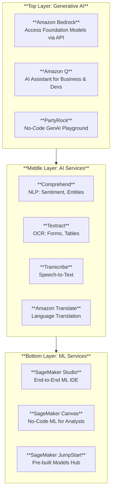

# Chapter 4: AWS AI and ML Services

> **THE AWS CERTIFIED AI PRACTITIONER EXAM OBJECTIVES COVERED IN THIS CHAPTER INCLUDE:**
> *   **Domain 1**: Fundamentals of AI and ML
>     *   **Task Statement 1.2**: Identify practical use cases for AI.
>     *   **Task Statement 1.3**: Describe the ML development lifecycle.
> *   **Domain 2**: Fundamentals of Generative AI
>     *   **Task Statement 2.3**: Describe AWS infrastructure and technologies for building generative AI applications.

---

## Introduction: The AWS AI/ML Promise
*   **The Challenge with Traditional AI/ML**: Costly infrastructure, complex data pipelines, need for highly skilled personnel, slow model training, and difficult deployment.
*   **The AWS Solution**: Managed AI/ML services that eliminate manual complexity, enabling faster innovation.
*   **Key Benefit**: Democratizes AI—even teams without deep technical expertise can build powerful AI applications.

---

## 1. The AWS AI/ML Stack: Three Layers
AWS offers a comprehensive suite organized into three layers, each serving different user personas.

*(Figure 4.1: The AWS AI/ML Stack)*

| Layer | Services | Target User | Key Benefit |
| :--- | :--- | :--- | :--- |
| **Top: Generative AI** | Bedrock, Q, PartyRock | App Developers, Business Users | Build creative/conversational apps with no infrastructure management. |
| **Middle: AI Services** | Comprehend, Textract, Transcribe, Translate | Software Engineers | Pre-trained APIs for common tasks (NLP, OCR, Speech). No model training needed. |
| **Bottom: ML Services** | SageMaker (Studio, Canvas, JumpStart) | ML Engineers, Data Scientists | Full control over the ML lifecycle: Build, Train, Deploy, Monitor. |

---

## 2. Amazon Bedrock: The Generative AI Platform
**Amazon Bedrock** is a managed service that provides access to high-performing **Foundation Models (FMs)** from multiple providers via a single, unified API. It is **serverless**—you don't manage any infrastructure.

### Why Bedrock?
*   **Choice**: Access models from Amazon (Titan, Nova), Anthropic (Claude), Meta (Llama), AI21 Labs, Stability AI.
*   **Flexibility**: Avoid vendor lock-in. Switch models easily via the same API.
*   **Simplicity**: Serverless inference scales automatically with demand.

---

### Bedrock Features Deep Dive

#### 1. Bedrock Playground
*   **What It Is**: An interactive console for experimenting with foundation models.
*   **Text Playground**: Test prompts, adjust inference parameters (Temperature, Top-P, Top-K).
*   **Image Playground**: Experiment with image generation models.
*   **Side-by-Side Comparison**: Compare multiple models on the same prompt to see latency, input/output tokens, and response quality.
*   **Why It Matters**: Allows you to validate model choice *before* writing code.

#### 2. Agents for Amazon Bedrock
*   **What They Do**: Enable foundation models to execute **multi-step tasks** by interacting with your enterprise systems (APIs, databases, Lambda functions).
*   **Example**: A customer asks, "Check if my order shipped and give me an update."
    *   The Agent understands the request, calls an Order API, retrieves the shipment status, and responds to the customer—all automatically.
*   **Benefit**: Automates *actions*, not just text generation. No manual prompt orchestration needed.

#### 3. Knowledge Bases for Amazon Bedrock (RAG)
*   **What It Is**: A fully managed **Retrieval-Augmented Generation (RAG)** capability.
*   **How It Works**:
    1.  Connect your data sources (S3, internal wikis, vector databases).
    2.  Bedrock automatically ingests, indexes, and stores the data.
    3.  When a user asks a question, the FM first *retrieves* relevant context from your data, then *generates* a response augmented with that context.
*   **Benefit**: Responses are **accurate, up-to-date, and grounded in your proprietary data**. Reduces hallucinations.

#### 4. Amazon Bedrock Data Automation
*   **What It Does**: Automatically extracts insights from **unstructured multimodal content** (documents, images, audio, video).
*   **Capabilities**:
    *   Generate video summaries of key moments.
    *   Detect inappropriate image content.
    *   Analyze complex documents.
*   **Why It Matters**: Powers Intelligent Document Processing (IDP), Media Analysis, and RAG workflows.

#### 5. Guardrails for Amazon Bedrock
*   **What They Do**: Apply safety and compliance filters to model inputs and outputs.
*   **Capabilities**:
    *   Block harmful, offensive, or off-topic content.
    *   Redact PII (Personal Identifiable Information) like credit card numbers or SSNs.
    *   Enforce domain-specific rules.
*   **Benefit**: Ensures outputs are safe, secure, and aligned with regulations (GDPR, HIPAA).

#### 6. Model Customization
Three distinct methods to tailor a foundation model to your needs:

| Method | What It Does | When to Use |
| :--- | :--- | :--- |
| **Fine-Tuning** | Train model on your **labeled** domain-specific data. | Adapt to specific tasks (e.g., your company's legal contracts). |
| **Continued Pre-training** | Expose model to large amounts of **unlabeled** domain data. | Teach the model your industry's vocabulary (e.g., medical journals). |
| **Model Distillation** | Compress a large "Teacher" model into a smaller, faster "Student" model. | Reduce inference cost/latency while retaining performance. |

*   **Custom Model Import**: Bring your own models trained outside Bedrock and host them in Bedrock's serverless environment.

#### 7. Foundation Model Evaluation
*   **Automated Evaluation**: Create jobs to generate metrics like semantic robustness.
*   **Human Evaluation**: Have a team rate model outputs for qualitative assessment.
*   **Benefit**: Comprehensive model comparison to choose the best FM for your use case.

---

### Bedrock Pricing
| Model | Description | Best For |
| :--- | :--- | :--- |
| **On-Demand** | Pay per token (text) or per image generated. No commitment. | Experimentation, variable/unpredictable traffic. |
| **Provisioned Throughput** | Reserve capacity (Model Units) for guaranteed performance. Commitment: 1 or 6 months for discounts. | Production workloads requiring consistent latency. |

> **Best Practice**: Use **On-Demand** during experimentation. Switch to **Provisioned Throughput** for production.

---

### Example Use Case: E-Commerce Intelligent Customer Support
A global e-commerce company needs to build an AI-powered support platform.

| Task | Bedrock Feature Used | How Applied |
| :--- | :--- | :--- |
| Handle multilingual queries | **Choice of Models** | Select models that support multiple languages. |
| Fetch product info (descriptions, specs) | **Knowledge Bases (RAG)** | Retrieve up-to-date data from enterprise knowledge bases. |
| Provide personalized recommendations | **Model Customization (Fine-Tuning)** | Train on user purchase history and preferences. |
| Secure sensitive customer info | **Guardrails** | Redact PII (credit card numbers), ensure GDPR/HIPAA compliance. |
| Automate workflows (refunds, order modifications) | **Agents** | Execute API calls to backend systems. |
| Improve performance over time | **Model Evaluation** | Continuously assess and fine-tune. |
| Generate summaries of order history | **Data Automation** | Summarize complex order data for customers. |

---

## 3. Amazon Q: The Generative AI Assistant
**Amazon Q** is a generative AI assistant designed to boost productivity for both business users and developers.

### Amazon Q Business
*   **Audience**: Business users (HR, Finance, Operations).
*   **Capabilities**:
    *   **Question Answering**: "What is our vacation policy?" (Connects to internal wikis, docs).
    *   **Data Summarization**: Summarize long reports or contracts.
    *   **Content Generation**: Draft emails, reports.
    *   **Task Automation**: Automate routine tasks via integrations with Jira, ServiceNow.
*   **Key Feature**: **QuickSight Integration** for **Generative BI**—ask natural language questions and get interactive dashboards.
*   **Security**: Role-based permissions ensure users only access authorized data.

### Amazon Q Developer
*   **Audience**: Developers and IT professionals.
*   **Capabilities**:
    *   Generate code, explain bugs, suggest fixes.
    *   Perform security scans.
    *   Optimize AWS resources.
    *   Upgrade applications (e.g., Java versions).
*   **Multistep Planning**: Handle complex development requests like implementing new features.
*   **Security**: Does NOT train on your code. Data stays private.

---

## 4. AWS PartyRock
*   **What It Is**: A no-code, interactive platform for building and sharing generative AI applications.
*   **How It Works**: Uses Amazon Bedrock's foundation models. Users combine "widgets" (text gen, image gen, chatbots) via a visual interface.
*   **Use Cases**: Create personalized playlists, craft stories, build demo chatbots.
*   **Target Audience**: Enthusiasts, educators, and professionals wanting rapid prototyping without coding.

---

## 5. AWS AI Services: Pre-Trained APIs
These are ready-to-use APIs. You send data; AWS returns insights. No model training required.

### Amazon Comprehend (NLP)
*   **What It Does**: Extract insights from unstructured text.
*   **Key Capabilities**:
    | Feature | Description |
    | :--- | :--- |
    | **Entity Recognition** | Identify People, Organizations, Dates, Locations. |
    | **Sentiment Analysis** | Determine emotional tone (Positive, Negative, Neutral, Mixed). |
    | **Key Phrase Extraction** | Find important phrases and topics. |
    | **PII Detection & Redaction** | Find and mask sensitive info (SSN, Phone Numbers). |
    | **Language Detection** | Identify the language of the input text. |
    | **Custom Entity Recognition** | Train to recognize domain-specific terms. |
*   **Amazon Comprehend Medical**: Specialized for healthcare. Extracts medications, conditions, dosages, and their relationships from clinical text. **HIPAA-eligible**.
*   **Advantages**: Fully managed, pay-as-you-go, no ML expertise needed.

### Amazon Textract (Intelligent Document Processing)
*   **What It Does**: Extract text, forms, and tables from scanned documents and images.
*   **Key Capabilities**:
    | Feature | Description |
    | :--- | :--- |
    | **OCR** | Detect printed and handwritten text. |
    | **Forms Extraction** | Extract Key-Value pairs (e.g., "Name: John Doe"). |
    | **Table Extraction** | Preserve row/column structure from financial reports, spreadsheets. |
    | **Queries** | Ask questions like "What is the invoice total?" |
*   **Integrations**: Works with S3, Lambda, Comprehend for end-to-end document automation pipelines.
*   **Compliance**: Supports HIPAA, GDPR for secure handling of sensitive documents.
*   **Advantages**: Fully managed, eliminates manual data entry.

### Amazon Transcribe (Speech-to-Text)
*   **What It Does**: Convert audio/video into text.
*   **Key Capabilities**:
    | Feature | Description |
    | :--- | :--- |
    | **Automatic Speech Recognition (ASR)** | Transcribe pre-recorded or live audio streams. |
    | **Speaker Identification (Diarization)** | Distinguish between multiple speakers in a conversation. |
    | **Custom Vocabulary** | Improve accuracy for domain-specific jargon (e.g., product names). |
    | **Real-Time Streaming** | Live captioning for conferences and broadcasts. |
    | **PII Redaction** | Automatically mask sensitive info in transcripts. |
*   **Amazon Transcribe Medical**: Specialized for medical dictation (drug names, procedures). **HIPAA-eligible**.
*   **Advantages**: Easy to use, integrates with S3, Comprehend, Translate.

### Amazon Translate
*   **What It Does**: Neural machine translation between 75+ languages.
*   **Key Capabilities**:
    | Feature | Description |
    | :--- | :--- |
    | **Real-Time Translation** | Translate chat or live content. |
    | **Batch Translation** | Translate large document sets. |
    | **Custom Terminology** | Ensure brand names or technical terms are not translated literally. |
    | **Automatic Language Detection** | Identify source language before translating. |
*   **Advantages**: Scalable, pay-as-you-go, integrates with S3, Lambda.

---

## 6. AWS ML Services: Amazon SageMaker
For ML Engineers and Data Scientists who need **full control** over the ML lifecycle.

### What is SageMaker?
A comprehensive, unified platform for building, training, and deploying machine learning models at scale.

### SageMaker Capabilities (Table 4.2)
| ML Lifecycle Step | SageMaker Feature | What It Does |
| :--- | :--- | :--- |
| **Prepare Data** | **Data Wrangler** | 300+ built-in transformations. Visual interface for data prep. Available in Canvas. |
| **Build with Notebooks** | **SageMaker Studio (JupyterLab/Code Editor)** | Integrated IDE for model development. Prebuilt kernels with ML libraries. |
| **Store Features** | **Feature Store** | Centralized repository for ML features. Ensures consistency between training and inference. Supports versioning and time-travel queries. |
| **Train Models** | **Distributed Training** | Prebuilt containerized algorithms, support for CPU/GPU, scales to hundreds of instances. |
| **Tune Parameters** | **Hyperparameter Tuning (HPO)** | Automated optimization (Bayesian search) to find the best settings. |
| **Deploy Models** | **Hosting Services** | Real-time, Batch, Asynchronous, or Serverless inference endpoints. |
| **Manage & Monitor** | **Model Monitor** | Detects **Data Drift**, **Bias**, and **Concept Drift** in production. Generates detailed reports. |

---

### SageMaker Horizontal Capabilities (Applied Across All Steps)

#### Human-in-the-Loop: SageMaker Ground Truth
*   **What It Does**: Create high-quality labeled datasets by combining automated labeling with human oversight.
*   **Active Learning**: Routes only low-confidence predictions to human labelers, reducing cost.
*   **Integration**: Works with third-party and in-house labeling teams.

#### MLOps: Automating the ML Lifecycle
*   **SageMaker Pipelines**: Automate and orchestrate end-to-end ML workflows (Data -> Train -> Deploy).
*   **Model Registry**: Catalog models, manage versions, and approve for production deployment.
*   **Continuous Monitoring**: Detect data and model drift. Enables CI/CD for ML.

#### Responsible AI: SageMaker Clarify
*   **Bias Detection**: Identify bias in datasets (pre-training) and model predictions (post-training).
*   **Explainability (XAI)**: Provides feature importance scores (SHAP values) to explain *why* a model made a prediction.
*   **Compliance**: Generates detailed reports for auditing and regulatory standards.

#### ML Governance
*   **SageMaker Experiments**: Track and organize training runs. Capture metadata for reproducibility.
*   **Model Registry**: Centralized versioning and approval workflows.
*   **Model Monitor**: Continuous tracking for drift and compliance.

---

### Specialized SageMaker Tools

| Tool | Audience | Capability |
| :--- | :--- | :--- |
| **SageMaker Studio** | Data Scientists, ML Engineers | Unified IDE for the entire ML lifecycle. |
| **SageMaker Canvas** | Business Analysts (No-Code) | Drag-and-drop interface to build ML models (Churn, Forecasting) without writing code. |
| **SageMaker JumpStart** | Everyone | "App Store" for models. One-click deploy of pre-trained open-source models (Llama, Falcon, Stable Diffusion) and prebuilt solutions. |
| **SageMaker Studio Lab** | Students, Educators, Hobbyists | **Free**, cloud-based JupyterLab environment for learning ML. Has compute limitations; not for production. |

---

### SageMaker Pricing
*   **SageMaker Studio**: Pay for underlying compute and storage. No extra fee for the IDE itself.
*   **SageMaker Canvas**: Pay-as-you-go per session or per month.
*   **SageMaker JumpStart**: Pay only for compute/storage used during training, customization, or deployment.
*   **JupyterLab**: Billed per hour for the compute instance used.

---

## Exam Essentials
*   **Three-Layer Stack**: GenAI (Bedrock, Q) -> AI Services (Comprehend, Textract) -> ML Services (SageMaker).
*   **Bedrock Features**: Choice of Models, Playground, RAG (Knowledge Bases), Agents, Guardrails, Model Customization (Fine-Tuning, Continued Pre-training, Distillation).
*   **Amazon Q**: Q Business (for business users, BI), Q Developer (for code generation, debugging).
*   **AI Services (Pre-trained APIs)**:
    *   **Comprehend**: NLP (Entities, Sentiment, PII). Comprehend Medical for healthcare.
    *   **Textract**: OCR++ (Forms, Tables, Queries).
    *   **Transcribe**: Speech-to-Text (Speaker ID, Streaming). Transcribe Medical.
    *   **Translate**: Neural Machine Translation.
*   **SageMaker**:
    *   **Studio**: Full IDE.
    *   **Canvas**: No-Code ML.
    *   **JumpStart**: Pre-built model hub.
    *   **Ground Truth**: Labeling.
    *   **Clarify**: Bias & Explainability.
    *   **Feature Store**: Consistent features.
    *   **Model Monitor**: Drift detection.

---

## Review Questions

**1. A company wants to build a generative AI application for document processing. Which AWS services can be used? (Choose two.)**
*   A. **Amazon Bedrock** ✓
*   B. **Amazon SageMaker JumpStart** ✓
*   C. Amazon DynamoDB
*   D. AWS Lambda

**2. Which AWS service provides serverless inference for generative AI with a variety of model choices behind a single API?**
*   A. Amazon SageMaker
*   B. **Amazon Bedrock** ✓
*   C. AWS Lambda
*   D. Amazon Comprehend

**3. A company wants a GenAI app that answers questions based on its private knowledge repository. Which Bedrock feature helps?**
*   A. Guardrails
*   B. **Knowledge Bases for RAG** ✓
*   C. SageMaker JumpStart
*   D. Agents

**4. A financial company needs to prevent investment advice, filter harmful content, and redact account numbers. Which Bedrock feature?**
*   A. Agents
*   B. Knowledge Bases
*   C. **Guardrails** ✓
*   D. JumpStart

**5. A retail company needs an assistant to check product availability and place orders via API calls. Which Bedrock feature?**
*   A. **Agents** ✓
*   B. Knowledge Bases
*   C. Guardrails
*   D. Lambda

**6. Which AWS services can fine-tune and deploy foundation models? (Choose two.)**
*   A. **Amazon Bedrock** ✓
*   B. **Amazon SageMaker** ✓
*   C. AWS Lambda
*   D. Amazon Comprehend

**7. Why is model customization important for FMs?**
*   A. To scale across cloud providers.
*   B. **To tailor behavior to specific tasks or domain requirements.** ✓
*   C. To reduce model size.
*   D. To operate independently of data sources.

**8. A company needs an AI assistant for devs (code, security scans) AND business users (reports, emails, policy Q&A). Which service?**
*   A. Redshift
*   B. S3
*   C. **Amazon Q** ✓
*   D. Comprehend

**9. Which AI services extract key entities (names, dates, locations) from text? (Choose two.)**
*   A. Rekognition
*   B. **Amazon Comprehend** ✓
*   C. **Amazon Bedrock** ✓
*   D. AWS Glue

**10. A global e-commerce company needs to translate customer queries to English and responses back to the customer's language. Which service?**
*   A. **Amazon Translate** ✓
*   B. Amazon Polly
*   C. Amazon Lex
*   D. SageMaker

**11. A business analyst wants to build ML models for sales forecasting WITHOUT writing code. Which service?**
*   A. Comprehend
*   B. Forecast
*   C. Feature Store
*   D. **SageMaker Canvas** ✓

**12. Which service stores, updates, and retrieves ML features for consistent training and inference?**
*   A. Redshift
*   B. RDS
*   C. **SageMaker Feature Store** ✓
*   D. Lambda
