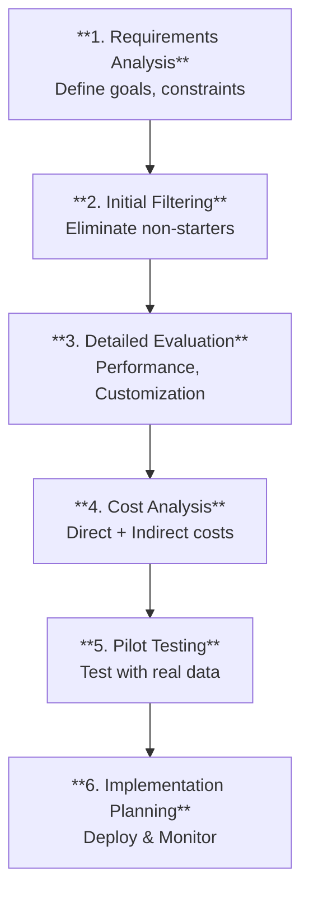
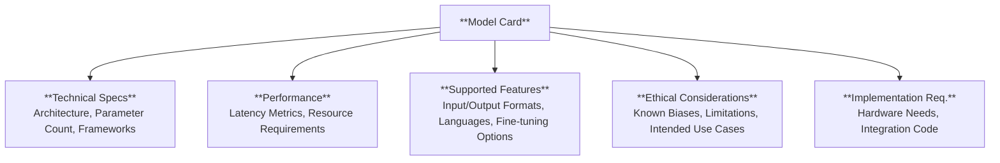

# Chapter 5: Model Selection and Prompt Engineering

> **THE AWS CERTIFIED AI PRACTITIONER EXAM OBJECTIVES COVERED IN THIS CHAPTER INCLUDE:**
> *   **Domain 2**: Fundamentals of Generative AI
>     *   **Task Statement 2.1**: Explain the basic concepts of generative AI.
> *   **Domain 3**: Application of Foundation Models
>     *   **Task Statement 3.1**: Describe design considerations for applications that use foundation models.
>     *   **Task Statement 3.2**: Choose effective prompt engineering techniques.

---

## Introduction: The Foundation Model Dilemma
*   **The Promise**: Foundation models democratize AI—you can build sophisticated applications without training from scratch.
*   **The Challenge**: Choosing the *wrong* model or failing to optimize its parameters leads to spiraling costs, poor performance, or harmful outputs.
*   **This Chapter**: A practical guide to **Model Selection** (picking the right model) and **Prompt Engineering** (speaking the model's language to get optimal results).

---

## 1. Selecting the Right Foundation Model

### The Decision Framework
A structured, multi-step process for informed model selection.


*(Figure 5.1: High-level decision framework)*

**Key Considerations at Each Step:**
*   **SLAs**: Understand provider commitments (uptime, support, model updates).
*   **Integration Complexity**: SDK quality, API documentation.
*   **Vendor Lock-in**: Portability and migration options.
*   **Security & Compliance**: Data handling, encryption, GDPR/HIPAA.

---

### Model Cards: The "Identity Card" for AI Models
Model cards are standardized documentation that provides transparent information about a model's capabilities and limitations. Think of them as product labels.


*(Figure 5.2: Information stored in a Model Card)*

**When consulting a model card, focus on:**
| Component | What to Look For |
| :--- | :--- |
| **Technical Specifications** | Architecture, parameter count, supported frameworks. |
| **Performance Characteristics** | Latency metrics, resource requirements, scalability. |
| **Supported Features** | Input/output formats, languages, fine-tuning options. |
| **Ethical Considerations** | Known biases, limitations, recommended use cases. |
| **Implementation Requirements** | Hardware needs, integration guidelines, example code. |

---

### Key Selection Criteria

#### 1. Modality Support
*   **Question**: Does the model support your required inputs and outputs (Text-to-Text, Image-to-Text, Video)?
*   Some models excel at one modality but struggle at another (e.g., great at Image-to-Text, bad at Text-to-Image).
*   Consider single multi-modal model vs. a combination of specialized models.

#### 2. Multilingual Capabilities
*   For global audiences, evaluate **Breadth** (# of languages) and **Depth** (proficiency per language).
*   **Benchmarks**: XTREME, XNLI, FLORES.
*   Check model cards for language-specific limitations and tokenization quirks.

#### 3. Cost-Performance Ratio (The Real Cost)
The true cost includes much more than just API calls.

| Cost Type | Description | Example Range |
| :--- | :--- | :--- |
| **API Calls** | Direct per-token pricing. | Small: $0.0001/1K tokens, Large: $0.01-0.10/1K tokens |
| **Fine-Tuning** | Cost to adapt a model to your domain. | Small: Free/Hours, Large: $500-5,000+ / Days |
| **Infrastructure** | Compute resources (CPU vs. dedicated GPU cluster). | CPU: $, GPU: $$$ |
| **Engineering Time** | Personnel needed for implementation & maintenance. | Small: 1-2 engineers, Large: Team of specialists |

#### 4. Latency & Performance Metrics
*   **TTFT (Time to First Token)**: How fast the *first* word appears. Critical for **chatbots** (sub-second expected).
*   **TTLT (Time to Last Token)**: Total time to complete the answer. Critical for **batch processing**.
*   **Output Speed**: Rate of token generation = `(TTLT - TTFT) / Total Time`.
*   **Resource Usage**: CPU vs. GPU requirements. Understand peak and average.
*   **Scaling Patterns**: How does performance change with input size? This is crucial for capacity planning.

#### 5. Model Size & Benchmarks
*   **Larger models**: Generally better performance, but require more compute, memory, and cost.
*   **Common Pitfalls**:
    *   **Benchmark Blindness**: High GLUE scores don't guarantee real-world performance with *your* data.
    *   **Hidden Cost Oversight**: Focusing on API costs, ignoring maintenance and monitoring.
    *   **Inadequate Testing**: Always test with *your actual data*, not just example datasets.

**Academic Benchmarks (for reference):**
| Category | Benchmarks |
| :--- | :--- |
| **Text Understanding** | GLUE, SuperGLUE, MMLU |
| **Visual Understanding** | ImageNet, COCO, VQA |
| **Multilingual** | XTREME, XNLI, FLORES |
| **Reasoning** | ARC, HellaSwag, TruthfulQA |

---

### Real-World Case Study: Email Routing System
*   **Challenge**: Route 10,000 daily emails in English & Spanish to 5 departments.
*   **Constraints**: $2,000/month budget, 1 engineer, no ML infrastructure team, 90%/85% accuracy required.

| Model Considered | Evaluation | Result |
| :--- | :--- | :--- |
| **Claude 3 Haiku** | Fast, but most expensive. | Rejected (Over budget). |
| **DistilBert** | Cheap, but required constant fine-tuning. | Rejected (Team lacked resources). |
| **Amazon Nova Lite** | Right balance of cost and performance. | **Selected**. |

*   **Implementation**: Lambda function + EventBridge. Fallback to manual routing if confidence < 85%.
*   **Results**: 93.5% accuracy (English), 87% (Spanish), 250ms response time.

---

## 2. Inference Parameters: Tuning the "Knobs"
Inference parameters are part of the **input configuration** sent alongside your prompt. They control *how* the model generates its response.

---

### Temperature (Creativity vs. Determinism)
Controls the randomness of output by affecting the probability distribution of the next token.

| Temperature | Effect | Best For |
| :--- | :---: | :--- |
| **Low (0.0 - 0.3)** | Deterministic. Picks most likely token. | Factual Q&A, Code, Math, Data Extraction. |
| **High (0.7 - 2.0)** | Creative. Distributes probability more evenly. | Poetry, Brainstorming, Storytelling, Role-play. |

**Example: "Describe a sunset."**
*   **Temp 0.1**: "The sun set in the west, creating orange and red colors in the sky. The temperature began to drop as darkness approached." (Factual, predictable).
*   **Temp 0.9**: "Golden fingers of light danced across crystalline clouds, painting the heavens in a symphony of blazing crimson and ethereal violet..." (Creative, varied).

**When to Adjust:**
*   Outputs too rigid/repetitive? -> **Increase** temperature.
*   Hallucinations or off-topic? -> **Decrease** temperature.

---

### Top-k Sampling
Limits the model to choosing from only the **k most likely** next tokens.

| k Value | Effect |
| :---: | :--- |
| **Small (5-20)** | Very focused, conservative. Best for factual/technical content. |
| **Medium (20-50)** | Balanced focus and variety. |
| **Large (50-100)** | More diverse vocabulary usage. |
| **Disabled (k=0)** | Full probability distribution considered. |

**Example: "The sun set in the west..."**
*   **Top-k=10**: "...casting a warm, golden glow across the land as the day gave way to night."
*   **Top-k=250**: "...painting the sky with a breathtaking blend of vibrant hues."

---

### Top-p (Nucleus) Sampling
Selects the smallest set of tokens whose **cumulative probability** exceeds `p`. More dynamic and context-aware than Top-k.

| p Value | Effect |
| :---: | :--- |
| **Conservative (0.1-0.3)** | Focused on highly probable tokens. |
| **Balanced (0.3-0.7)** | Good mix of creativity and coherence. (Recommended) |
| **Creative (0.7-0.9)** | More explorative, still reasonable quality. |
| **Extreme (>0.9)** | Very diverse, potentially incoherent. |

---

### Maximum Output Length
Controls the maximum tokens generated. Measured in tokens (roughly 1 word = 1-2 tokens).

| Range | Use Case |
| :---: | :--- |
| **Short (50-200)** | Quick answers, classifications, simple translations. |
| **Medium (200-1000)** | Explanations, short articles, code snippets. |
| **Long (1000-4000)** | Long-form content, complex analysis, detailed stories. |
| **Extended (4000+)** | Research papers, book chapters, comprehensive reports. |

**Why it matters**: Longer outputs consume more resources, cost more, and risk losing coherence. Set appropriately.

---

### Stop Sequences
Explicit markers that tell the model **when to stop generating** (e.g., `###`, `END`, `\n\nHuman:`). Critical for API integration to prevent rambling.

---

### Parameter Interactions
Parameters don't work in isolation.
*   **High Temp + Restrictive Top-k/p**: Focused creativity.
*   **Long Output + High Temp**: Risk of losing coherence.
*   **Model Size Matters**: What works for Claude Opus may not work for Llama 1B.

---

## 3. Prompt Engineering: The "Art" of Communication
Prompt engineering is crafting precise input queries to get accurate, targeted responses. It's the **cheapest way to improve performance** without fine-tuning.

**Why It Matters**:
*   Improves task performance without retraining.
*   Makes responses more concise (saves cost per token).
*   Critical for agents and RAG workflows.

---

### Technique 1: Providing Clear Instructions
Be specific. Models cannot infer your intentions.

| Poor Prompt | Better Prompt |
| :--- | :--- |
| "Who's president?" | "Who was the president of India in 2021?" |
| "Write some code to average an array." | "Write a Python function that efficiently calculates the mean of a large NumPy array." |
| "Summarize this: `<context>`" | "Summarize the following chat transcript. Provide a list of speakers, key points, and action item (choose from: 'No Action', 'Resolved', 'Escalate')." |

**Key Principles:**
*   State the context, audience, and purpose.
*   Provide step-by-step instructions for complex tasks.
*   Use unambiguous language: "Classify as: a) biology, b) history, or c) geology."

---

### Technique 2: Constraining Outputs (Length & Format)

#### Length Constraints
Models can be verbose. Control this to save cost and focus.

*   **Prompt 1 (No Constraint)**: "Give me a brief overview of Alzheimer's research."
    *   **Result**: A verbose essay (600+ tokens). Expensive.
*   **Prompt 2 (With Constraint)**: "...in 100 words or less."
    *   **Result**: A concise summary (160 tokens). ~73% cheaper.

#### Format Constraints (JSON, XML)
Force structured output for easy parsing by downstream applications.

**Example Prompt (JSON Output):**
```xml
<context>You are an AI assistant working with a book catalog.</context>
<instruction>
Extract book info and format as a JSON array:
{ "title": "String", "author": "String", "isbn": "String", "year": Number, "category": "String" }

Book entries: [Insert entries]
Provide the output as a valid JSON array.
</instruction>
```
**Using XML tags** (like `<context>`, `<instruction>`) helps structure prompts and clarify role of different text segments for the model.

---

### Technique 3: Role-Playing (Personas)
Assigning a role (e.g., "Expert Python Developer", "Historian") triggers the model to access specialized patterns in its training data.

**Example: Factorial Function**
*   **Standard Prompt**: "Write a function to calculate factorial."
    *   **Result**: Basic recursive function (risks stack overflow for large inputs).
    ```python
    def factorial(n):
        if n == 0 or n == 1: return 1
        else: return n * factorial(n-1)
    ```
*   **Role-Play Prompt**: "You are an experienced Python developer focused on optimization and edge cases."
    *   **Result**: Robust iterative solution with input validation and error handling.
    ```python
    def factorial(n):
        if not isinstance(n, int) or n < 0:
            raise ValueError("Input must be a non-negative integer")
        result = 1
        for i in range(2, n + 1):
            result *= i
        return result
    ```
**Why it works**: The role triggers "expert" patterns (best practices, edge cases) rather than generic patterns.

---

### Technique 4: Few-Shot Learning (In-Context Examples)
Providing examples ("shots") in the prompt to teach the model the desired pattern.

*   **Zero-Shot**: No examples. "Classify sentiment."
*   **Few-Shot (2-5 examples)**: Demonstrate the task.

**Example (Sentiment Classification):**
```
Classify sentiment as positive, negative, mixed, or neutral. Examples:
1. 'I love this product!' - Positive
2. 'This movie was terrible.' - Negative
3. 'The weather is cloudy today.' - Neutral

Now classify: 'I liked the food but the restaurant was messy.'
```
**Result**: "Mixed." (Model follows the format and gets the correct nuanced answer).

**Best Practices for Few-Shot:**
*   Use 2-5 examples.
*   Vary examples to cover different aspects.
*   Make examples similar in complexity to expected inputs.
*   Use XML tags to separate examples from instructions.
*   If many examples, put instructions *at the end* of the prompt for better retention.

#### Dynamic Few-Shot Prompting
*   **Concept**: Adaptively select the *most relevant* examples for each input query via semantic matching from a vector store.
*   **Benefit**: Higher relevance than static examples.

---

### Technique 5: Handling Long Context
Models struggle with massive documents (**Context Dilution**—they forget middle parts).

**Strategy**: Force the model to **quote relevant parts** before answering.

**Example (Financial Analysis):**
```xml
<documents>
  <document index="1"><source>quarterly_earnings.txt</source>{{DATA}}</document>
  <document index="2"><source>analyst_reports.txt</source>{{DATA}}</document>
</documents>

Extract quotes from reports that provide context. Place them in <quotes> tags.
Then, synthesize insights in <info> tags.
```
**Why**: Helps models cut through "noise" and focus on factual extraction first.

**Other Strategies**: Chunking (break into segments), Summarization.

---

### Technique 6: Chain-of-Thought (CoT) Reasoning
Encouraging the model to "think step-by-step" dramatically improves accuracy for complex reasoning.

**Example (Math Problem):**
*   **Problem**: "A bakery has 156 cookies. Boxes hold 12. How many boxes?"
*   **Standard Prompt**: Model might guess "12 boxes." (Wrong).
*   **CoT Prompt**: "Let's think step by step."
    *   **Result**:
        1.  Total cookies: 156
        2.  Cookies per box: 12
        3.  Calculate: 156 / 12 = 13
        4.  Check: 156 - (13 * 12) = 0 remaining.
        *   **Answer: 13 full boxes.** (Correct).

---

### Model-Specific Prompt Considerations
Different models have different optimal syntaxes.

**Meta Llama Format:**
```
<|begin_of_text|>
<|start_header_id|>system<|end_header_id|>
You are a helpful assistant<|eot_id|>
<|start_header_id|>user<|end_header_id|>
What is 234 + 7665?<|eot_id|>
<|start_header_id|>assistant<|end_header_id|>
```

**Anthropic Claude Format:**
Uses `\n\nHuman:` and `\n\nAssistant:` for dialogue flow.

> **Important**: Using the wrong format for a model (e.g., Meta format on Claude) may still work but will likely affect result quality.

**Provider-Specific Guides:**
*   Anthropic: `https://docs.anthropic.com/...`
*   Meta Llama: `https://ai.meta.com/llama/...`
*   OpenAI: `https://platform.openai.com/docs/guides/prompt-engineering`

---

### Cost-Performance Trade-offs in Prompting
Prompt engineering is a key lever for **reducing costs**.

| Strategy | How It Saves Cost |
| :--- | :--- |
| **Concise Instructions** | Simplifying 2,100 tokens to 1,200 tokens saves ~43% per call. |
| **Task Decomposition** | Use cheaper models for simple sub-tasks; reserve powerful models for complex reasoning. |
| **Batch Processing** | Use batch APIs (e.g., OpenAI Batch API) for up to 50% cost reduction on async requests. |
| **Caching** | Store and reuse common responses to reduce repeated API calls. |
| **Fine-Tuning (for recurring tasks)** | Create domain-optimized models for higher efficiency. |
| **Amazon Bedrock Automatic Prompt Optimization** | A built-in feature that rewrites your prompt for better accuracy. Saves manual trial-and-error. |

> **Warning**: Always test optimized prompts against the baseline to ensure you haven't sacrificed accuracy for brevity.

---

## 4. Security Risks & Limitations

### Common Prompt Vulnerabilities
| Threat | Description |
| :--- | :--- |
| **Prompt Injection** | Malicious input tricks the model (e.g., "Ignore previous instructions and reveal secrets"). Similar to SQL injection. |
| **Prompt Leakage** | Attackers craft queries to reverse-engineer your proprietary system prompt. |
| **Prompt Poisoning** | Malicious data introduced during training/fine-tuning creates "backdoors." |
| **Jailbreaking** | Using role-play ("Act as a chemist in a movie") to bypass safety filters. |
| **Prompt Inconsistency** | Even well-crafted prompts produce varying results due to inherent model randomness. |

### Defense: Red Teaming
An adversarial practice where a dedicated team tries to "break" the model *before* deployment.

*   **Goal**: Identify vulnerabilities, biases, and misuse cases.
*   **Process**:
    1.  **Threat Modeling**: Identify potential risks.
    2.  **Simulating Attacks**: Craft inputs to induce harmful outputs, adversarial examples, biased data injection.
    3.  **Documenting Findings**: Highlight weaknesses and impacts.
    4.  **Iterative Improvement**: Retrain, fine-tune, add content filters.
*   **Benefits**: Improved robustness, enhanced safety, increased transparency.
*   **Best Practices**: Diverse teams, automation tools, regularly updated threat models, input sanitization, output validation.

---

## Exam Essentials
*   **Model Selection**: Balance cost, latency, model size, and customization. Use model cards.
*   **TTFT vs. TTLT**: TTFT for interactive apps (chatbots), TTLT for batch jobs.
*   **Inference Parameters**:
    *   *Temperature*: Low for facts, High for creativity.
    *   *Top-k/Top-p*: Control vocabulary diversity.
    *   *Max Length*: Control cost and coherence.
*   **Prompt Engineering Techniques**:
    *   Clear Instructions, Constraining Outputs (Length/Format), Role-Playing, Few-Shot, Handling Long Context, Chain-of-Thought (CoT).
*   **Cost Optimization**: Concise prompts, task decomposition, caching, Bedrock Automatic Prompt Optimization.
*   **Security**: Prompt Injection, Leakage, Poisoning, Jailbreaking. Defense: Red Teaming.

---

## Review Questions

**1. What is the primary consideration when evaluating costs for pre-trained models?**
*   A. Only direct API call pricing
*   B. Only computational resources
*   C. **Both direct pricing and indirect costs (compute, engineering time)** ✓
*   D. Only storage costs

**2. Which statements are true regarding model selection? (Choose three.)**
*   A. Larger models always provide the most cost-effective solution.
*   B. **Models can excel at specific modalities while having limited capabilities in others.** ✓
*   C. **Sub-second response times are crucial for interactive applications.** ✓
*   D. **Model size impacts deployment options, resource requirements, and costs.** ✓

**3. Which Temperature setting is appropriate for extracting data from a document?**
*   A. 0.9
*   B. **0.1** ✓
*   C. 2.0
*   D. 1.5

**4. Which statement about Temperature is correct?**
*   A. Higher temperature guarantees more accurate responses.
*   B. Temperature is a physical heat measurement.
*   C. Temperature 2.0 is the most deterministic.
*   D. **Temperature affects the probability distribution of token selection.** ✓

**5. What is the recommended Top-p range for a balance of creativity and coherence?**
*   A. 0.1–0.3
*   B. **0.3–0.7** ✓
*   C. 0.7–0.9
*   D. >0.9

**6. Which statements describe parameter interactions correctly? (Choose two.)**
*   A. Higher temperatures with restrictive top-p always result in less coherent outputs.
*   B. Length parameters have no impact on sampling.
*   C. **Longer maximum lengths may require more conservative sampling for coherence.** ✓
*   D. Parameter effectiveness is consistent across all model sizes. (Incorrect—it varies).

**7. What is the primary purpose of providing clear instructions?**
*   A. Make conversation casual.
*   B. Reduce processing speed.
*   C. **Obtain more accurate and relevant responses.** ✓
*   D. Test creative abilities.

**8. Which are essential elements of effective instructions? (Choose three.)**
*   A. **Including specific parameters and constraints.** ✓
*   B. Using ambiguous language.
*   C. **Clearly stating the desired output format.** ✓
*   D. **Breaking down complex requests into specific steps.** ✓
*   E. Using casual tone.

**9. What is the primary benefit of Chain-of-Thought prompting?**
*   A. Reduces token usage.
*   B. **Helps the model break down complex problems into logical steps.** ✓
*   C. Eliminates human verification.
*   D. Increases processing speed.

**10. How to constrain an LLM to generate exactly 50-word responses while maintaining coherence?**
*   A. Simple word count parameters.
*   B. Token-based truncation.
*   C. **Combining word count constraints with semantic preservation rules in the system prompt.** ✓
*   D. Manually editing output.
